# Sistema de Gestión de Inventarios

API REST desarrollada con **Node.js**, **Express**, **TypeScript** y **Prisma ORM** para la administración de productos, inventario, órdenes de compra y alertas de stock.

El proyecto fue desarrollado siguiendo los principios de **Clean Architecture**, con el objetivo de mantener una clara separación entre la lógica de negocio, la infraestructura y la capa de presentación, facilitando el mantenimiento, la escalabilidad y las pruebas.

---

# Tecnologías utilizadas

| Tecnología | Descripción |
|------------|-------------|
| Node.js 22 | Entorno de ejecución |
| TypeScript | Lenguaje principal |
| Express | Framework para la API REST |
| Prisma ORM | Acceso y gestión de la base de datos |
| PostgreSQL | Base de datos relacional |
| Docker & Docker Compose | Contenedores para el entorno de desarrollo |
| Zod | Validación de DTOs |
| Vitest | Pruebas unitarias |
| Supertest | Pruebas de integración |
| PNPM | Gestor de paquetes |

---

# Arquitectura

El proyecto implementa **Clean Architecture**, separando las responsabilidades en distintas capas.

```text
                HTTP Request
                     │
                     ▼
             Presentation Layer
         (Routes + Controllers)
                     │
                     ▼
               Use Cases
          (Lógica de negocio)
                     │
                     ▼
          Repository Interfaces
                     │
                     ▼
         Datasource Interfaces
                     │
                     ▼
 Infrastructure (Prisma ORM)
                     │
                     ▼
               PostgreSQL
```

## ¿Por qué Clean Architecture?

Se eligió esta arquitectura porque permite:

- Separar completamente la lógica de negocio de Express y Prisma.
- Facilitar la escritura de pruebas unitarias.
- Reducir el acoplamiento entre capas.
- Permitir cambiar la implementación de persistencia sin modificar la lógica de negocio.
- Favorecer la escalabilidad y el mantenimiento del proyecto.

Además, durante el desarrollo se aplicaron principios **SOLID**, especialmente:

- **Single Responsibility Principle (SRP)**
- **Dependency Inversion Principle (DIP)**
- **Open/Closed Principle (OCP)**

---

# Estructura del proyecto

```text
management-system-express-api/
├── .env.template
├── .gitignore
├── README.md
├── docker-compose.yml
├── package.json
├── pnpm-lock.yaml
├── pnpm-workspace.yaml
├── prisma.config.ts
├── tsconfig.build.json
├── tsconfig.json
├── vitest.config.ts
├── setupTests.ts
│
├── prisma/
│   ├── schema.prisma
│   └── migrations/
│       ├── 20260703221831_init/
│       ├── 20260703222216_map_name/
│       ├── 20260704082217_update_product_sku/
│       ├── 20260704083437_product_history/
│       ├── 20260704160532_alert_and_purchases_orders/
│       ├── 20260704160748_mappers_alert_orders/
│       ├── 20260704164000_relation_product_alert/
│       ├── 20260704170940_dates_alerts_orders/
│       ├── 20260704175127_alert_one_product/
│       ├── 20260704202346_add_motivo_order/
│       ├── 20260705004451_delete_cascade/
│       ├── 20260705004743_active_field_product/
│       ├── 20260705005123_sku_unique_product/
│       ├── 20260705052225_one_to_many_product_alert/
│       ├── 20260705061759_add_type_catgory_in_product/
│       └── migration_lock.toml
│
├── public/
│   └── index.html
│
└── src/
    ├── app.ts
    │
    ├── config/
    │   └── envs.ts
    │
    ├── data/
    │   └── const/
    │       └── seed_products.ts
    │
    ├── domain/                         # Capa de dominio (Clean Architecture)
    │   ├── datasource/
    │   │   ├── alert.datasource.ts
    │   │   ├── order.datasource.ts
    │   │   └── product.datasource.ts
    │   ├── dtos/
    │   │   ├── alert/filter-alert.dto.ts
    │   │   ├── order/
    │   │   │   ├── create-order.dto.ts
    │   │   │   └── update-status-order.dto.ts
    │   │   ├── products/
    │   │   │   ├── create-product.dto.ts
    │   │   │   ├── filter-product.dto.ts
    │   │   │   └── update-amount-prodcut.dto.ts
    │   │   └── index.ts
    │   ├── entities/
    │   │   ├── alert.entity.ts
    │   │   ├── order.entity.ts
    │   │   ├── product-extended.entity.ts
    │   │   ├── product-history.entity.ts
    │   │   └── product.entity.ts
    │   ├── error/
    │   │   └── custom-error.ts
    │   ├── repositories/
    │   │   ├── alert.repository.ts
    │   │   ├── order.repository.ts
    │   │   └── product.repository.ts
    │   ├── use-cases/
    │   │   ├── alert/get-alerts.ts
    │   │   ├── order/
    │   │   │   ├── create-order.ts
    │   │   │   └── update-status-order.ts
    │   │   └── products/
    │   │       ├── create-product.ts
    │   │       ├── get-product.ts
    │   │       ├── get-products.ts
    │   │       ├── seed-products.ts
    │   │       └── update-amount-product.ts
    │   └── index.ts
    │
    ├── infrastructure/                 # Implementaciones concretas
    │   ├── datasource/
    │   │   ├── alert.datasource.impl.ts
    │   │   ├── order.datasource.impl.ts
    │   │   └── product.datasource.impl.ts
    │   └── repositories/
    │       ├── alert.repository.impl.ts
    │       ├── order.repository.impl.ts
    │       └── product.repository.impl.ts
    │
    ├── presentation/                   # Controladores y rutas (Express)
    │   ├── alert/
    │   │   ├── controller.ts
    │   │   └── routes.ts
    │   ├── order/
    │   │   ├── controller.ts
    │   │   └── routes.ts
    │   ├── products/
    │   │   ├── controller.ts
    │   │   └── routes.ts
    │   ├── routes.ts
    │   └── server.ts
    │
    ├── types/
    │   └── error-zod.type.ts
    │
    └── utils/
        └── formatErrrorsSchemasZod.ts
```

Las responsabilidades principales son:

- **domain/** → Entidades, DTOs, casos de uso, contratos e interfaces.
- **infrastructure/** → Implementaciones concretas de repositorios y datasources.
- **presentation/** → Controladores, rutas y servidor Express.
- **data/** → Datos iniciales (seed) y constantes.
- **config/** → Configuración del proyecto.

---

# Requisitos

Antes de ejecutar el proyecto debes tener instalado:

- Node.js **22** o superior
- PNPM
- Docker
- Docker Compose

Puedes verificarlo ejecutando:

```bash
node -v
pnpm -v
docker -v
docker compose version
```

---

# Instalación

## 1. Clonar el repositorio

```bash
git clone https://github.com/SantiagoPa/management-system-express-api.git

cd management-system-express-api
```

---

## 2. Instalar dependencias

```bash
pnpm install
```

---

## 3. Configurar variables de entorno

Copiar el archivo:

```text
.env.template
```

como:

```text
.env
```

y completar las variables necesarias.

---

## 4. Levantar PostgreSQL y Correr el proyecto en local

```bash
docker compose up -d
```

---

## 5. Ejecutar migraciones

```bash
pnpm run prisma:migrate:dev
```

---

## 6. Ejecutar la aplicación

```bash
pnpm run dev
```

La API estará disponible en:

```text
http://localhost:3000
```

(o el puerto configurado en el archivo `.env`).

---
## 7. Documentacion uso de la API

[click aqui documentacion postman](https://documenter.getpostman.com/view/25517816/2sBY4HV4pX#474b896a-c1ed-49ea-9c38-7eb69592c28c)

---
## 8. API desplegeda en la nube

URL: `https://management-system-express-api-production.up.railway.app/api/healthy`
---
# Funcionalidades implementadas

## Gestión de productos

- Crear productos.
- Consultar todos los productos.
- Consultar un producto por ID.
- Filtrar productos.
- Ajustar inventario (entrada y salida).
- Carga inicial de productos mediante Seed.

## Gestión de órdenes

- Crear órdenes de compra.
- Aprobar órdenes.
- Rechazar órdenes.
- Recibir órdenes.

## Gestión de alertas

- Consultar alertas.
- Filtrar alertas por estado.
- Generación automática de alertas de stock bajo.

---

# Validaciones

La aplicación utiliza **Zod** para validar todos los DTOs de entrada.

Entre las validaciones implementadas se encuentran:

- Campos requeridos.
- Tipos de datos.
- Enumeraciones.
- Cantidades positivas.
- Longitudes mínimas.
- Reglas de negocio.
- Formatos específicos.

Todas las validaciones se realizan antes de ejecutar cualquier caso de uso.

---

# Manejo de errores

Se implementó un manejo centralizado de errores mediante:

- Clase `CustomError`.
- Validaciones con Zod.
- Respuestas HTTP consistentes.
- Mensajes descriptivos para el consumidor de la API.

Se contemplan errores de:

- Validación.
- Reglas de negocio.
- Recursos inexistentes.
- Persistencia.

---

# Seguridad

Se implementaron medidas básicas de seguridad como:

- Validación estricta de todas las entradas.
- Separación entre DTOs y entidades del dominio.
- Uso de Prisma ORM para prevenir inyecciones SQL.
- Manejo controlado de excepciones.
- Exposición únicamente de la información necesaria al cliente.

---

# Testing

El proyecto cuenta con pruebas unitarias y de integración desarrolladas con:

- **Vitest**
- **Supertest**

Las pruebas cubren:

- DTOs.
- Casos de uso.
- Controladores.
- Endpoints.
- Validaciones.
- Reglas de negocio.

Ejecutar todas las pruebas:

```bash
pnpm run test
```

Ejecutar reporte de cobertura:

```bash
pnpm run test:coverage
```

# Cobertura de las pruebas

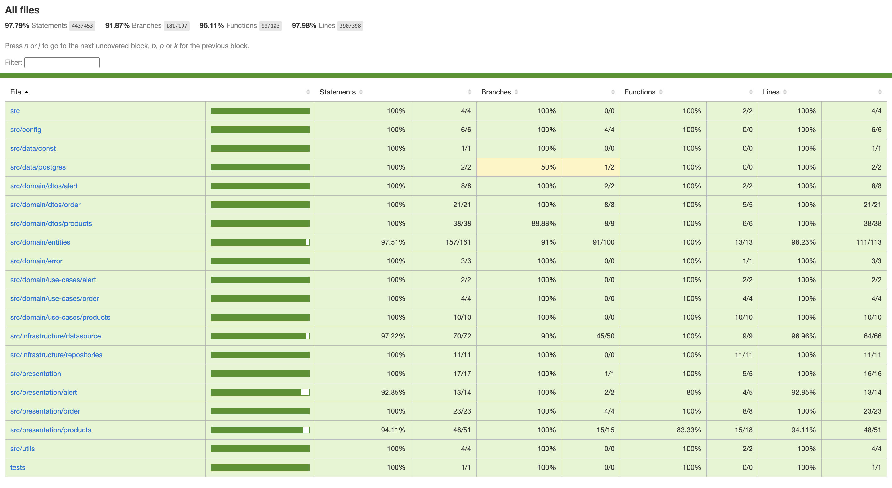

---

# Principios de diseño aplicados

Durante el desarrollo se aplicaron los siguientes principios y patrones:

- Clean Architecture.
- SOLID.
- Repository Pattern.
- Dependency Injection.
- DTO Pattern.
- Use Case Pattern.
- Separation of Concerns.

---

# Base de datos

La persistencia se realiza mediante **PostgreSQL** utilizando **Prisma ORM**.

Las migraciones se encuentran versionadas dentro de:

```text
prisma/migrations
```

permitiendo reproducir el esquema completo de la base de datos en cualquier entorno de ejecución.

# Ejemplo de uso y ruta critica de la API

tengo configurada una variable en postman que es `url_prod` que apunta a la api desplegada, esta variable de entorno la puedes establecer o poner el endpoint completo ej:

- opcion 1: `https://management-system-express-api-production.up.railway.app/api`
- opcion 2: `http://localhost:3000/api`

y completarla con los endpoits que estan de ejemplo o como se ven en las imagenes, recuerda revisar la documentacion en [postman](https://documenter.getpostman.com/view/25517816/2sBY4HV4pX#474b896a-c1ed-49ea-9c38-7eb69592c28c)

Podemos ejecutar endpoint a endpoint, y crear varios productos, pero para eso prepare un seed para que la base de datos inicie con varios productos con los que se puedan iniciar flujos.

- **`endpoint (POST): /api/products/seed`**, limpia la base de datos y crea 6 productos iniciales.

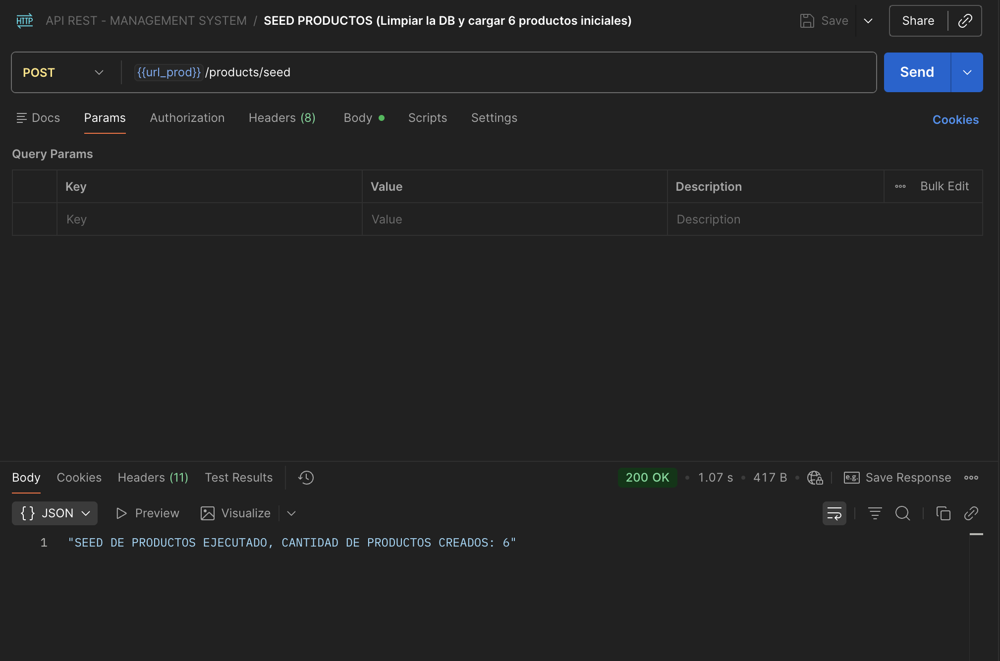

- **`endpoint (GET): /api/products`**, optiene los productos del inventario y se puede filtrar por categoría, proveedor, estado de alerta (productos con alerta activa) y rango de stock (ej: productos con stock entre X y Y)

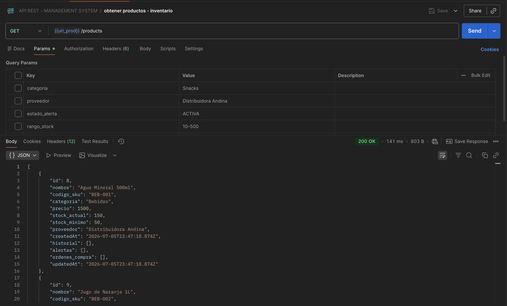

```json
[
    {
        "id": 8,
        "nombre": "Agua Mineral 500ml",
        "codigo_sku": "BEB-001",
        "categoria": "Bebidas",
        "precio": 1500,
        "stock_actual": 150,
        "stock_minimo": 50,
        "proveedor": "Distribuidora Andina",
        "createdAt": "2026-07-05T23:47:18.874Z",
        "historial": [],
        "alertas": [],
        "ordenes_compra": [],
        "updatedAt": "2026-07-05T23:47:18.874Z"
    },
    {
        "id": 9,
        "nombre": "Jugo de Naranja 1L",
        "codigo_sku": "BEB-002",
        "categoria": "Bebidas",
        "precio": 3200,
        "stock_actual": 30,
        "stock_minimo": 40,
        "proveedor": "Lácteos del Valle",
        "createdAt": "2026-07-05T23:47:18.874Z",
        "historial": [],
        "alertas": [],
        "ordenes_compra": [],
        "updatedAt": "2026-07-05T23:47:18.874Z"
    },
    {
        "id": 10,
        "nombre": "Leche Entera 1L",
        "codigo_sku": "LAC-001",
        "categoria": "Lacteos",
        "precio": 2100,
        "stock_actual": 200,
        "stock_minimo": 60,
        "proveedor": "Lácteos del Valle",
        "createdAt": "2026-07-05T23:47:18.874Z",
        "historial": [],
        "alertas": [],
        "ordenes_compra": [],
        "updatedAt": "2026-07-05T23:47:18.874Z"
    },
    {
        "id": 11,
        "nombre": "Yogur Natural 500g",
        "codigo_sku": "LAC-002",
        "categoria": "Lacteos",
        "precio": 2800,
        "stock_actual": 15,
        "stock_minimo": 25,
        "proveedor": "Lácteos del Valle",
        "createdAt": "2026-07-05T23:47:18.874Z",
        "historial": [],
        "alertas": [],
        "ordenes_compra": [],
        "updatedAt": "2026-07-05T23:47:18.874Z"
    },
    {
        "id": 12,
        "nombre": "Papas Fritas 200g",
        "codigo_sku": "SNA-001",
        "categoria": "Snacks",
        "precio": 2500,
        "stock_actual": 80,
        "stock_minimo": 30,
        "proveedor": "SnacksCorp",
        "createdAt": "2026-07-05T23:47:18.874Z",
        "historial": [],
        "alertas": [],
        "ordenes_compra": [],
        "updatedAt": "2026-07-05T23:47:18.874Z"
    },
    {
        "id": 13,
        "nombre": "Detergente 1L",
        "codigo_sku": "LIM-001",
        "categoria": "Limpieza",
        "precio": 4500,
        "stock_actual": 45,
        "stock_minimo": 20,
        "proveedor": "Químicos del Sur",
        "createdAt": "2026-07-05T23:47:18.874Z",
        "historial": [],
        "alertas": [],
        "ordenes_compra": [],
        "updatedAt": "2026-07-05T23:47:18.874Z"
    }
]
```
- `validaciones`: validaciones en los campos para filtrar

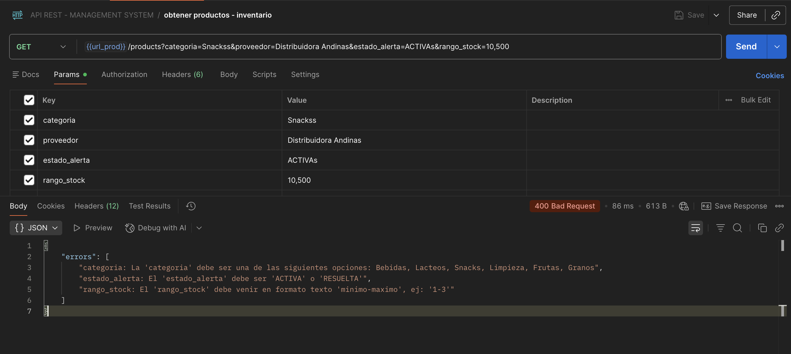

- **`endpoint (POST): /api/products`** Crear un producto

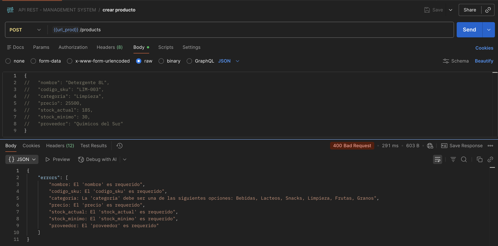

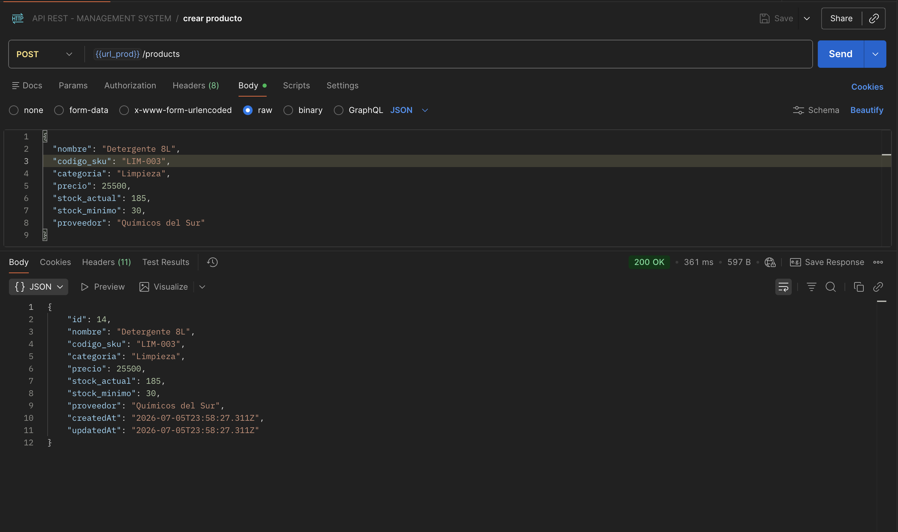

- **`endpoint (GET): /api/products/:id`** Buscar un producto por su `id`

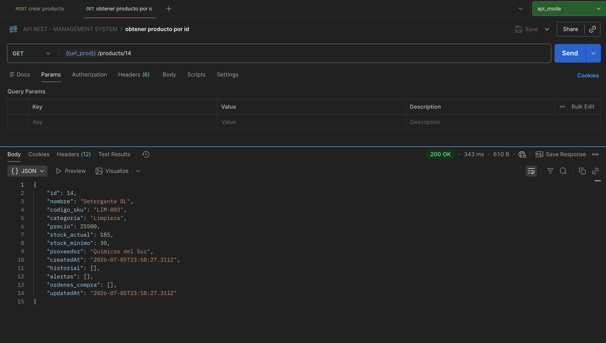

# Ruta critica

## Ajuste de Inventario

- **`endpoint (PUT): /api/products/14/inventory-adjustment`** realiza un movimiento de aumento o disminucion en el stock y se crea un historial de movimiento

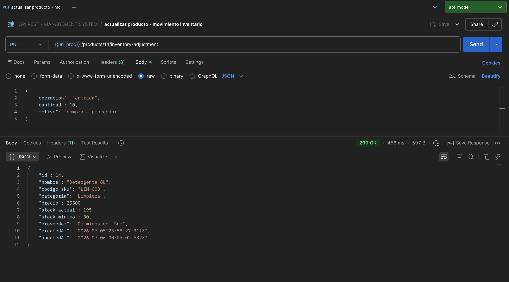

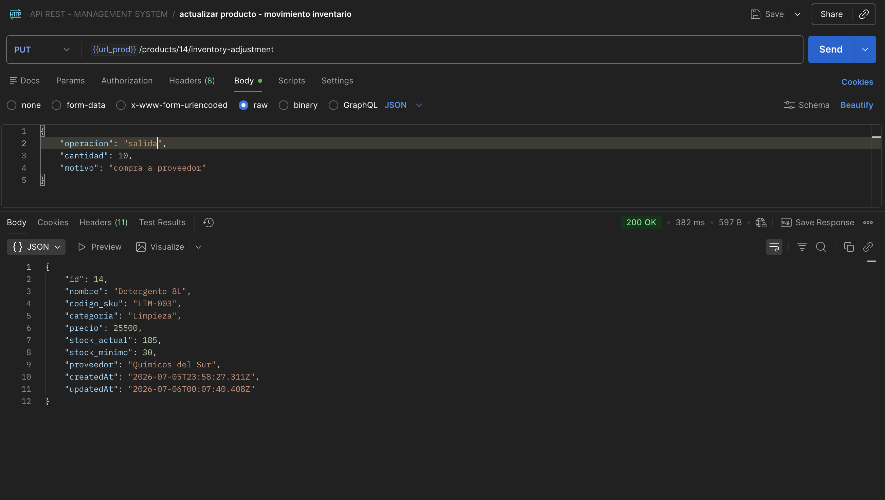

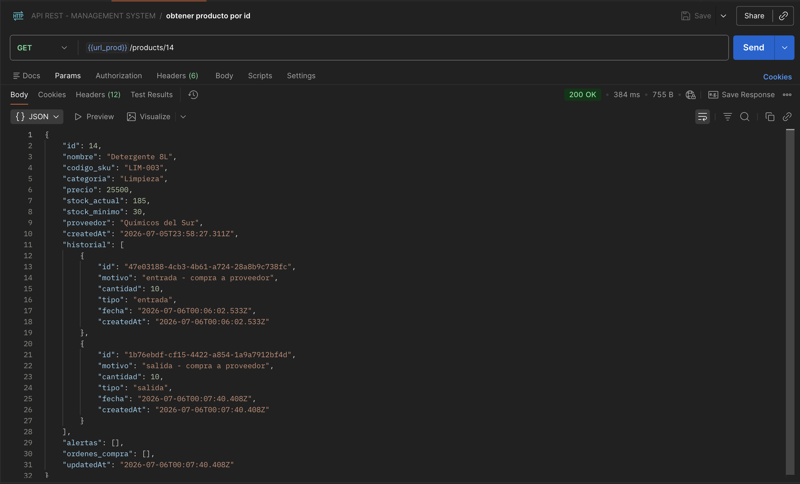

## Alertas de Stock Bajo y generacion de orden de compra

siguiendo la reglas de negocio, vamos a hacer un movimiento de stock donde el `stock_actual` quede por debajo del `stock_minimo`, generando asi una alrte y una orden de compra.

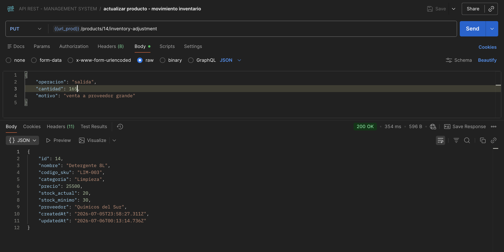

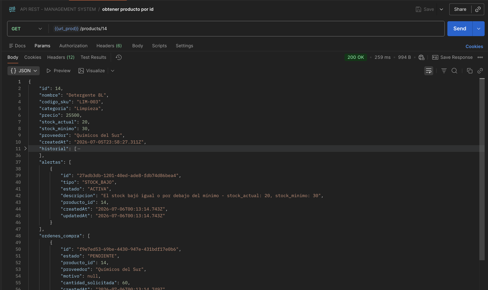

```json
{
    "id": 14,
    "nombre": "Detergente 8L",
    "codigo_sku": "LIM-003",
    "categoria": "Limpieza",
    "precio": 25500,
    "stock_actual": 20,
    "stock_minimo": 30,
    "proveedor": "Químicos del Sur",
    "createdAt": "2026-07-05T23:58:27.311Z",
    "historial": [
        {
            "id": "47e03188-4cb3-4b61-a724-28a8b9c738fc",
            "motivo": "entrada - compra a proveedor",
            "cantidad": 10,
            "tipo": "entrada",
            "fecha": "2026-07-06T00:06:02.533Z",
            "createdAt": "2026-07-06T00:06:02.533Z"
        },
        {
            "id": "1b76ebdf-cf15-4422-a854-1a9a7912bf4d",
            "motivo": "salida - compra a proveedor",
            "cantidad": 10,
            "tipo": "salida",
            "fecha": "2026-07-06T00:07:40.408Z",
            "createdAt": "2026-07-06T00:07:40.408Z"
        },
        {
            "id": "e7f8bbaa-7a97-439f-9df9-91c7ce0311ab",
            "motivo": "salida - venta a proveedor grande",
            "cantidad": 165,
            "tipo": "salida",
            "fecha": "2026-07-06T00:13:14.736Z",
            "createdAt": "2026-07-06T00:13:14.736Z"
        }
    ],
    "alertas": [
        {
            "id": "27adb3db-1201-40ed-ade8-fdb74d86bea4",
            "tipo": "STOCK_BAJO",
            "estado": "ACTIVA",
            "descripcion": "El stock bajó igual o por debajo del mínimo - stock_actual: 20, stock_minimo: 30",
            "producto_id": 14,
            "createdAt": "2026-07-06T00:13:14.743Z",
            "updatedAt": "2026-07-06T00:13:14.743Z"
        }
    ],
    "ordenes_compra": [
        {
            "id": "f9e7ed53-69be-4430-947e-431bdf17e0b6",
            "estado": "PENDIENTE",
            "producto_id": 14,
            "proveedor": "Químicos del Sur",
            "motivo": null,
            "cantidad_solicitada": 60,
            "createdAt": "2026-07-06T00:13:14.749Z",
            "updatedAt": "2026-07-06T00:13:14.749Z"
        }
    ],
    "updatedAt": "2026-07-06T00:13:14.736Z"
}
```

## Gestión de Estados de Órdenes

siguiendo las reglas de negocio vamos a aprobar y recibir la orden, para que aumente el stock y cierre la alerta generada


- **`endpoint (PUT): /api/orders/:id`** en este endpoint se actualiza el estado de las ordenes.

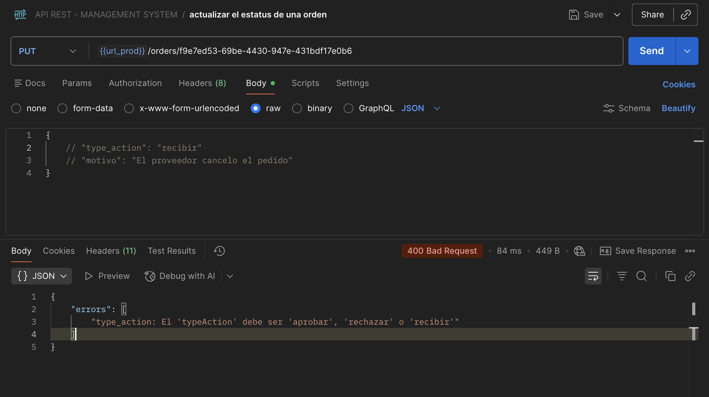

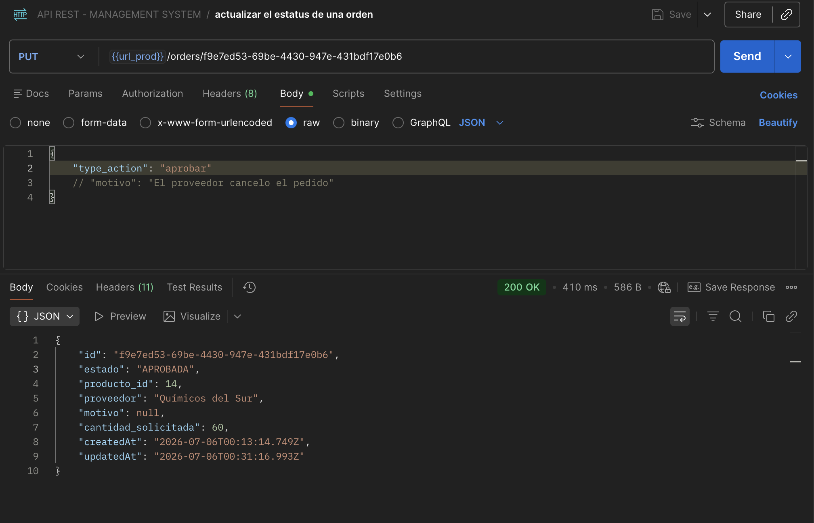

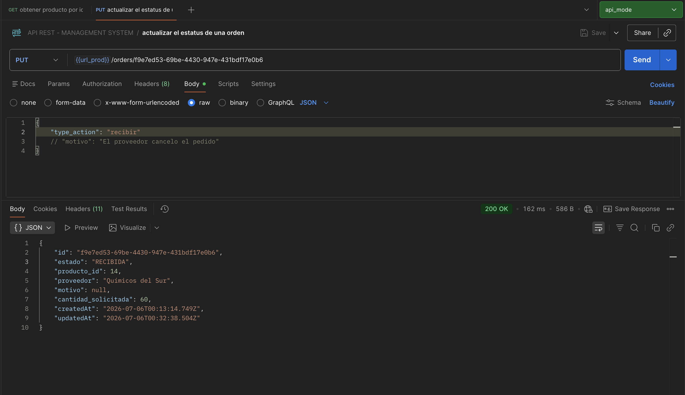

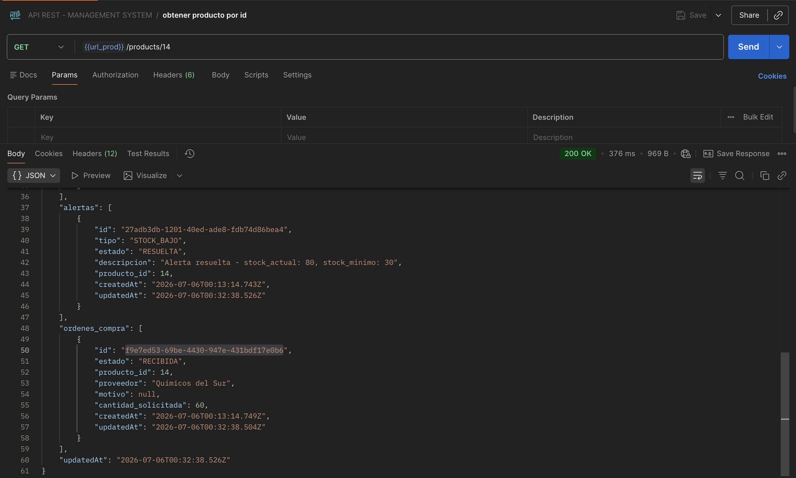

Alerta y order resultas


